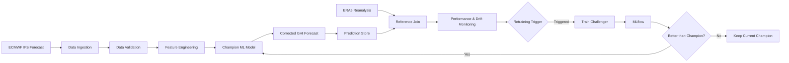

# Malang Solar MLOps

> An end-to-end MLOps project for short-term solar irradiance forecast correction in Malang, Indonesia, using dynamic meteorological data and continuous training.

## Overview

`malang-solar-mlops` is an evolving Machine Learning Operations (MLOps) project focused on improving short-term solar irradiance forecasts for Malang, Indonesia.

Instead of predicting solar irradiance entirely from scratch, this project applies **machine-learning-based forecast correction**. A numerical weather prediction model first produces a raw solar irradiance forecast, then a machine learning model learns historical forecast errors and estimates a correction that brings the forecast closer to an ERA5 reanalysis reference.

The project is designed not only as a machine learning experiment, but as a production-oriented ML system covering:

- dynamic data ingestion,
- data validation and versioning,
- feature engineering,
- model training and experiment tracking,
- model registry and serving,
- drift and performance monitoring,
- automated retraining,
- and continuous model delivery.

---

## Problem Formulation

Solar irradiance forecasts are important inputs for estimating short-term photovoltaic (PV) energy potential. However, numerical weather prediction models may exhibit systematic errors caused by cloud conditions, atmospheric variability, forecast horizon, seasonality, and changes in the upstream weather model.

This project formulates the problem as **supervised regression through residual correction**.

For each forecast:

```text
residual = ERA5 reference GHI - raw forecast GHI
```

The machine learning model predicts this residual, and the final forecast is calculated as:

```text
corrected GHI = raw forecast GHI + predicted residual
```

where GHI refers to **Global Horizontal Irradiance**, expressed in W/m².

---

## Data Sources

### Operational Forecast

The final pipeline is designed around **ECMWF IFS HRES forecasts** accessed through the **Open-Meteo Single Runs API**.

Single Runs preserve information about individual forecast runs, allowing the project to explicitly track:

- `run_time` — when the forecast model was initialized,
- `valid_time` — the time being predicted,
- `lead_time` — the forecast horizon.

The initial project scope focuses on short-term forecasts from **+1 to +6 hours**.

Forecast features include:

| Feature | Description |
|---|---|
| Temperature | Forecast air temperature at 2 m |
| Relative humidity | Forecast atmospheric humidity |
| Precipitation | Forecast precipitation |
| Cloud cover | Forecast cloud coverage |
| Pressure | Mean sea-level pressure |
| Wind speed | Forecast wind speed at 10 m |
| Wind direction | Forecast wind direction |
| Raw GHI | Raw shortwave radiation forecast |
| Lead time | Forecast horizon in hours |
| Time features | Cyclical hour and seasonal representations |

### Reference Target

**ERA5 reanalysis** is used as the reference target for evaluating historical forecasts.

ERA5 is treated as a **reference / proxy ground truth**, not as a direct physical sensor measurement from a pyranometer in Malang.

Because ERA5 becomes available after a delay, model performance monitoring is designed to operate asynchronously: predictions are stored first and evaluated after their corresponding reference values become available.

---

## Initial Feasibility Study

Before finalizing the operational data pipeline, an initial feasibility study was conducted using the Open-Meteo Historical Forecast API and ERA5.

The historical test dataset covered:

```text
2023-01-01 → 2026-08-17
```

with:

```text
31,800 hourly observations
100% temporal completeness
0 missing timestamps
0 duplicate timestamps
```

A temporal train-test split was used rather than a random split:

```text
Training : 2023 → 2025
Testing  : 2026
```

Evaluation was restricted to daylight observations to avoid artificially low errors from nighttime GHI values near zero.

### Initial Results

| Model | MAE (W/m²) | RMSE (W/m²) | Bias (W/m²) | Improvement |
|---|---:|---:|---:|---:|
| Raw forecast | 79.41 | 120.13 | +49.71 | Baseline |
| Linear Regression correction | 65.93 | 94.97 | +19.67 | +16.98% |
| Random Forest correction | **61.42** | **92.28** | **+4.81** | **+22.66%** |
| HistGradientBoosting correction | 61.70 | 93.00 | +9.04 | +22.31% |

The initial experiment suggests that forecast errors contain a **learnable correction signal**.

> **Important:** these results were produced during the feasibility stage using the Historical Forecast API. Final model benchmarks will be recomputed using the ECMWF IFS Single Runs dataset so that forecast initialization time and lead time are explicitly preserved.

---

## Planned MLOps Architecture

The target production workflow is:



The final system is planned to incorporate:

| Component | Planned Technology |
|---|---|
| Source control | GitHub |
| Workflow automation | GitHub Actions |
| Data versioning | DVC |
| Experiment tracking | MLflow |
| Model registry | MLflow Model Registry |
| Model serving | MLflow Models / containerized service |
| Containerization | Docker |
| Service orchestration | Docker Compose |
| Metrics collection | Prometheus |
| Monitoring dashboard | Grafana |

---

## Continuous Training Strategy

The project will use a **hybrid continuous-training strategy** instead of retraining the model after every new observation.

Candidate retraining can be triggered by:

1. **Scheduled evaluation** — periodic challenger training.
2. **Performance degradation** — increasing rolling MAE, RMSE, or bias.
3. **Data drift** — persistent changes in meteorological feature distributions or prediction behavior.

Retraining does not automatically replace the production model.

A newly trained **challenger** must first be evaluated against the current **champion** using recent temporally held-out data. Only a challenger that satisfies the model acceptance criteria will be promoted.

---

## Monitoring Strategy

### Model Performance

- Rolling MAE
- Rolling RMSE
- Rolling bias
- Raw forecast vs corrected forecast performance

### Data Health

- Missing values
- Schema validity
- Value ranges
- Data freshness
- Feature drift
- Prediction drift

### Service Health

- Prediction requests
- Prediction errors
- Inference latency
- Data ingestion status

Prometheus will collect operational metrics, while Grafana will provide the monitoring dashboard.

---

## Repository Structure

Current repository structure:

```text
malang-solar-mlops/
│
├── src/
│   ├── data/
│   │   ├── test_openmeteo_solar.py
│   │   └── test_single_run.py
│   │
│   └── model/
│       └── sanity_baseline.py
│
├── .gitignore
├── requirements.txt
└── README.md
```

Planned structure will expand as the project progresses:

```text
malang-solar-mlops/
│
├── data/
│   ├── raw/
│   └── processed/
│
├── notebooks/
│
├── src/
│   ├── data/
│   ├── features/
│   ├── model/
│   ├── monitoring/
│   └── serving/
│
├── tests/
├── prometheus/
├── grafana/
│
├── .github/
│   └── workflows/
│
├── dvc.yaml
├── docker-compose.yml
├── Dockerfile
├── requirements.txt
└── README.md
```

---

## Current Development Status

| Stage | Status |
|---|---|
| Problem formulation | ✅ Completed |
| Historical data feasibility | ✅ Completed |
| ERA5 reference feasibility | ✅ Completed |
| Temporal ML sanity test | ✅ Completed |
| ECMWF IFS Single Runs validation | 🚧 In progress |
| Historical Single Runs audit | ⏳ Planned |
| Final dataset construction | ⏳ Planned |
| DVC data versioning | ⏳ Planned |
| MLflow experiment tracking | ⏳ Planned |
| Final model experimentation | ⏳ Planned |
| Model serving | ⏳ Planned |
| CI/CD automation | ⏳ Planned |
| Drift monitoring | ⏳ Planned |
| Prometheus & Grafana monitoring | ⏳ Planned |
| Automated continuous training | ⏳ Planned |

---

## Getting Started

### Clone the repository

```bash
git clone https://github.com/maulnite/malang-solar-mlops.git
cd malang-solar-mlops
```

### Create a virtual environment

This project currently uses `uv` for Python environment management.

```bash
uv venv .venv
```

Windows PowerShell:

```powershell
.venv\Scripts\Activate.ps1
```

Install dependencies:

```bash
uv pip install -r requirements.txt
```

### Run the historical feasibility test

```bash
python src/data/test_openmeteo_solar.py
```

### Test an ECMWF IFS Single Run

```bash
python src/data/test_single_run.py
```

### Run the initial ML sanity test

Run the historical feasibility script first so that the required local dataset is available.

```bash
python src/model/sanity_baseline.py
```

Generated raw datasets are intentionally excluded from normal Git versioning and will later be managed through DVC.

---

## Project Direction

The repository is currently transitioning from **problem and data-source feasibility** into a complete MLOps implementation.

The next major milestone is to construct and audit the final historical dataset using ECMWF IFS Single Runs, recompute the baseline under the final forecasting setup, and then progressively integrate data versioning, experiment tracking, serving, monitoring, and automated retraining.

The long-term objective is a reproducible pipeline capable of:

```text
fetch → validate → predict → observe → monitor → retrain → evaluate → deploy
```

while keeping the production model versioned, measurable, and replaceable as weather patterns and upstream forecast behavior evolve.
