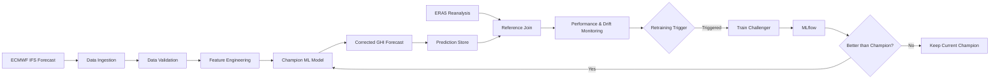

# Malang Solar MLOps

> An end-to-end MLOps project for short-term solar irradiance forecast correction in Malang, Indonesia, using dynamic meteorological data and continuous training.

## Overview

`malang-solar-mlops` is an evolving Machine Learning Operations (MLOps) project focused on improving short-term solar irradiance forecasts for Malang, Indonesia.

Instead of predicting solar irradiance entirely from scratch, this project applies **machine-learning-based forecast correction**. A numerical weather prediction model first produces a raw solar irradiance forecast, then a machine learning model learns historical forecast errors and estimates a correction that brings the forecast closer to an ERA5 reanalysis reference.

The project is designed not only as a machine learning experiment, but as a production-oriented ML system covering:

- dynamic data ingestion,
- data validation and versioning,
- feature engineering,
- model training and experiment tracking,
- model registry and serving,
- drift and performance monitoring,
- automated retraining,
- and continuous model delivery.

---

## Problem Formulation

Solar irradiance forecasts are important inputs for estimating short-term photovoltaic (PV) energy potential. However, numerical weather prediction models may exhibit systematic errors caused by cloud conditions, atmospheric variability, forecast horizon, seasonality, and changes in the upstream weather model.

This project formulates the problem as **supervised regression through residual correction**.

For each forecast:

```text
residual = ERA5 reference GHI - raw forecast GHI
```

The machine learning model predicts this residual, and the corrected forecast is calculated as:

```text
corrected GHI = raw forecast GHI + predicted residual
```

where GHI refers to **Global Horizontal Irradiance**, expressed in W/m².

---

## Data Sources

### Operational Forecast

The final pipeline is designed around **ECMWF IFS HRES forecasts** accessed through the **Open-Meteo Single Runs API**.

Single Runs preserve information about individual forecast runs, allowing the project to explicitly track:

- `run_time` — when the forecast model was initialized,
- `valid_time` — the time being predicted,
- `lead_time` — the forecast horizon.

The initial project scope focuses on short-term forecasts from **+1 to +6 hours**.

Forecast features include:

| Feature | Description |
|---|---|
| Temperature | Forecast air temperature at 2 m |
| Relative humidity | Forecast atmospheric humidity |
| Precipitation | Forecast precipitation |
| Cloud cover | Forecast cloud coverage |
| Pressure | Mean sea-level pressure |
| Wind speed | Forecast wind speed at 10 m |
| Wind direction | Forecast wind direction |
| Raw GHI | Raw shortwave radiation forecast |
| Lead time | Forecast horizon in hours |
| Time features | Cyclical hour and seasonal representations |

### Reference Target

**ERA5 reanalysis** is used as the reference target for evaluating historical forecasts.

ERA5 is treated as a **reference / proxy ground truth**, not as a direct physical sensor measurement from a pyranometer in Malang.

Because ERA5 becomes available after a delay, model performance monitoring is designed to operate asynchronously. Predictions are stored first and evaluated after their corresponding ERA5 reference values become available.

---

## Initial Feasibility Study

Before finalizing the operational data pipeline, an initial feasibility study was conducted using the Open-Meteo Historical Forecast API and ERA5.

The historical feasibility dataset covered:

```text
2023-01-01 → 2026-08-17
```

with:

```text
31,800 hourly observations
100% temporal completeness
0 missing timestamps
0 duplicate timestamps
```

A temporal train-test split was used rather than a random split:

```text
Training : 2023 → 2025
Testing  : 2026
```

Evaluation was restricted to daylight observations to avoid artificially low errors caused by nighttime GHI values near zero.

### Initial Results

| Model | MAE (W/m²) | RMSE (W/m²) | Bias (W/m²) | Improvement |
|---|---:|---:|---:|---:|
| Raw forecast | 79.41 | 120.13 | +49.71 | Baseline |
| Linear Regression correction | 65.93 | 94.97 | +19.67 | +16.98% |
| Random Forest correction | **61.42** | **92.28** | **+4.81** | **+22.66%** |
| HistGradientBoosting correction | 61.70 | 93.00 | +9.04 | +22.31% |

The initial experiment suggests that forecast errors contain a **learnable correction signal**.

> **Important:** these results were produced during the feasibility stage using the Historical Forecast API. Final model benchmarks will be recomputed using the ECMWF IFS Single Runs dataset so that forecast initialization time and lead time are explicitly preserved.

---

## Planned MLOps Architecture

The target production workflow is:


```mermaid
flowchart LR
    A[ECMWF IFS Forecast] --> B[Data Ingestion]
    B --> C[Data Validation]
    C --> D[Feature Engineering]
    D --> E[Champion ML Model]
    E --> F[Corrected GHI Forecast]
    F --> G[Prediction Store]

    H[ERA5 Reanalysis] --> I[Reference Join]
    G --> I

    I --> J[Performance & Drift Monitoring]
    J --> K{Retraining Trigger}
    K -->|Triggered| L[Train Challenger]
    L --> M[MLflow]
    M --> N{Better than Champion?}
    N -->|Yes| E
    N -->|No| O[Keep Current Champion]
```

The final system is planned to incorporate:

| Component | Technology |
|---|---|
| Source control | GitHub |
| Development environment | GitHub Codespaces |
| Workflow automation | GitHub Actions |
| Data versioning | DVC |
| Experiment tracking | MLflow |
| Model registry | MLflow Model Registry |
| Model serving | MLflow Models / containerized service |
| Containerization | Docker |
| Service orchestration | Docker Compose |
| Metrics collection | Prometheus |
| Monitoring dashboard | Grafana |

---

## Development Environment

The repository provides a reproducible cloud-based development environment using **GitHub Codespaces** and a repository-level Dev Container configuration.

The environment is defined in:

```text
.devcontainer/devcontainer.json
```

The current Codespaces setup provides:

- Python 3.11,
- automatic dependency installation from `requirements.txt`,
- Python development support,
- Pylance,
- Jupyter support,
- and Ruff for Python linting and formatting.

Dependencies are automatically installed when a new Codespace is created.

### Codespaces Validation

The configured environment has been validated using:

```bash
python --version
```

Expected environment:

```text
Python 3.11.x
```

Project dependencies can be validated using:

```bash
python -c "import numpy, pandas, requests, sklearn; print('Dependencies OK')"
```

Expected result:

```text
Dependencies OK
```

The repository has also been verified to open successfully inside GitHub Codespaces with the standardized project structure available.

This ensures that contributors can reproduce the same Python environment without manually configuring dependencies on their local machine.

---

## Branching Strategy

This repository follows a lightweight **GitHub Flow** strategy.

The `main` branch is treated as the stable integration branch. Development work is performed on dedicated branches before being merged through a Pull Request.

Branch naming conventions:

```text
feat/<feature-name>   → new feature or experiment
fix/<bug-name>        → bug fix
chore/<task-name>     → infrastructure or maintenance task
docs/<topic-name>     → documentation changes
```

Example workflow:

```text
main
  │
  └── feat/lk02-infrastructure
          │
          ├── project structure setup
          ├── Codespaces configuration
          ├── environment validation
          └── documentation update
                  │
                  ▼
             Pull Request
                  │
             validation
                  │
                  ▼
                main
```

Example commands:

```bash
git switch main
git pull origin main
git switch -c feat/example-feature
```

After making changes:

```bash
git add .
git commit -m "feat: describe the implemented feature"
git push -u origin feat/example-feature
```

A Pull Request is then created from the feature branch into `main`.

Changes should be validated before being merged into the stable branch.

---

## Continuous Training Strategy

The project will use a **hybrid continuous-training strategy** instead of retraining the model after every new observation.

Candidate retraining can be triggered by:

1. **Scheduled evaluation** — periodic challenger training.
2. **Performance degradation** — increasing rolling MAE, RMSE, or bias.
3. **Data drift** — persistent changes in meteorological feature distributions or prediction behavior.

Retraining does not automatically replace the production model.

A newly trained **challenger** must first be evaluated against the current **champion** using recent temporally held-out data.

Only a challenger that satisfies the model acceptance criteria will be promoted.

---

## Monitoring Strategy

The future production system is designed to monitor three main areas.

### Model Performance

- Rolling MAE
- Rolling RMSE
- Rolling bias
- Raw forecast vs corrected forecast performance

### Data Health

- Missing values
- Schema validity
- Value ranges
- Data freshness
- Feature drift
- Prediction drift

### Service Health

- Prediction requests
- Prediction errors
- Inference latency
- Data ingestion status

Prometheus will collect operational metrics, while Grafana will provide monitoring dashboards.

---

## Repository Structure

The repository currently follows a standardized ML/MLOps project structure:

```text
malang-solar-mlops/
│
├── .devcontainer/
│   └── devcontainer.json
│
├── config/
│   └── .gitkeep
│
├── data/
│   ├── raw/
│   │   └── .gitkeep
│   └── processed/
│       └── .gitkeep
│
├── models/
│   └── .gitkeep
│
├── notebooks/
│   └── .gitkeep
│
├── src/
│   ├── data/
│   │   ├── test_openmeteo_solar.py
│   │   └── test_single_run.py
│   │
│   └── model/
│       └── sanity_baseline.py
│
├── tests/
│   └── .gitkeep
│
├── .gitignore
├── LICENSE
├── README.md
└── requirements.txt
```

The structure will expand as the MLOps pipeline is implemented:

```text
malang-solar-mlops/
│
├── .github/
│   └── workflows/
│
├── config/
├── data/
│   ├── raw/
│   └── processed/
│
├── models/
├── notebooks/
│
├── src/
│   ├── data/
│   ├── features/
│   ├── model/
│   ├── monitoring/
│   └── serving/
│
├── tests/
├── prometheus/
├── grafana/
│
├── dvc.yaml
├── Dockerfile
├── docker-compose.yml
├── requirements.txt
└── README.md
```

---

## Current Development Status

| Stage | Status |
|---|---|
| Problem formulation | ✅ Completed |
| Historical data feasibility | ✅ Completed |
| ERA5 reference feasibility | ✅ Completed |
| Temporal ML sanity test | ✅ Completed |
| Standardized repository structure | ✅ Completed |
| GitHub Codespaces setup | ✅ Completed |
| Codespaces dependency validation | ✅ Completed |
| GitHub Flow infrastructure branch | ✅ Completed |
| ECMWF IFS Single Runs validation | 🚧 In progress |
| Historical Single Runs audit | ⏳ Planned |
| Final dataset construction | ⏳ Planned |
| DVC data versioning | ⏳ Planned |
| MLflow experiment tracking | ⏳ Planned |
| Final model experimentation | ⏳ Planned |
| Model serving | ⏳ Planned |
| CI/CD automation | ⏳ Planned |
| Drift monitoring | ⏳ Planned |
| Prometheus & Grafana monitoring | ⏳ Planned |
| Automated continuous training | ⏳ Planned |

---

## Getting Started

There are two supported ways to work with this project:

1. GitHub Codespaces
2. Local Python environment

### Option 1 — GitHub Codespaces

Open the repository on GitHub and select:

```text
Code
→ Codespaces
→ Create codespace
```

The Dev Container will automatically configure the Python environment and install project dependencies.

Verify the environment:

```bash
python --version
```

and:

```bash
python -c "import numpy, pandas, requests, sklearn; print('Dependencies OK')"
```

---

### Option 2 — Local Development

Clone the repository:

```bash
git clone https://github.com/maulnite/malang-solar-mlops.git
cd malang-solar-mlops
```

Create a Python virtual environment using `uv`:

```bash
uv venv .venv
```

Activate the environment on Windows PowerShell:

```powershell
.venv\Scripts\Activate.ps1
```

Install dependencies:

```bash
uv pip install -r requirements.txt
```

---

## Running Current Experiments

### Historical Data Feasibility Test

```bash
python src/data/test_openmeteo_solar.py
```

This script evaluates the availability, completeness, and structure of historical forecast and ERA5 data.

---

### ECMWF IFS Single Run Test

```bash
python src/data/test_single_run.py
```

This script is used to validate the final operational forecast source based on ECMWF IFS Single Runs.

---

### Initial ML Sanity Test

The historical feasibility dataset must be generated first.

Then run:

```bash
python src/model/sanity_baseline.py
```

The script compares raw forecast performance with several residual-correction models using temporal evaluation.

---

## Data Versioning Policy

Generated datasets are intentionally excluded from normal Git versioning.

Current raw and processed data paths:

```text
data/raw/
data/processed/
```

These directories are preserved in Git using `.gitkeep`, while generated dataset files are ignored through `.gitignore`.

As the project progresses, reproducible training datasets will be versioned using **DVC** rather than stored directly in Git.

---

## Project Direction

The repository is currently transitioning from **problem and data-source feasibility** into a complete MLOps implementation.

The next major milestones are:

1. validate and audit historical ECMWF IFS Single Runs availability,
2. construct the final forecast-reference dataset,
3. establish DVC-based dataset versioning,
4. track model experiments with MLflow,
5. containerize and serve the champion model,
6. monitor system and model performance,
7. detect drift and performance degradation,
8. automatically train challenger models,
9. validate challengers against the current champion,
10. deploy improved models through an automated workflow.

The long-term objective is a reproducible pipeline capable of:

```text
fetch
  ↓
validate
  ↓
feature engineering
  ↓
predict
  ↓
store
  ↓
observe
  ↓
monitor
  ↓
retrain
  ↓
evaluate
  ↓
deploy
```

while keeping the production model, datasets, experiments, and infrastructure versioned and reproducible.

---

## License

This project is licensed under the **MIT License**.

See the `LICENSE` file for details.