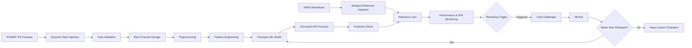

# Malang Solar MLOps

> An end-to-end MLOps project for short-term solar irradiance forecast correction in Malang, Indonesia, using dynamic meteorological data and continuous training.

---

## Overview

`malang-solar-mlops` is an evolving Machine Learning Operations (MLOps) project focused on improving short-term solar irradiance forecasts for Malang, Indonesia.

Instead of predicting solar irradiance entirely from scratch, this project applies **machine-learning-based forecast correction**. A numerical weather prediction model first produces a raw solar irradiance forecast, then a machine learning model learns historical forecast errors and estimates a correction that brings the forecast closer to an ERA5 reanalysis reference.

The project is designed not only as a machine learning experiment, but as a production-oriented ML system covering:

- dynamic data ingestion,
- automated data validation and preprocessing,
- feature engineering,
- data versioning,
- model training and experiment tracking,
- model registry and serving,
- drift and performance monitoring,
- automated retraining,
- and continuous model delivery.

---

## Problem Formulation

Solar irradiance forecasts are important inputs for estimating short-term photovoltaic (PV) energy potential. However, numerical weather prediction models may exhibit systematic errors caused by cloud conditions, atmospheric variability, forecast horizon, seasonality, and changes in the upstream weather model.

This project formulates the problem as **supervised regression through residual correction**.

For each forecast:

```text
residual = ERA5 reference GHI - raw forecast GHI
```

The machine learning model predicts this residual, and the corrected forecast is calculated as:

```text
corrected GHI = raw forecast GHI + predicted residual
```

where GHI refers to **Global Horizontal Irradiance**, expressed in W/m².

---

## Data Sources

### Operational Forecast

The final pipeline is designed around **ECMWF IFS HRES forecasts** accessed through the **Open-Meteo Single Runs API**.

Single Runs preserve information about individual forecast runs, allowing the project to explicitly track:

- `run_time` — when the forecast model was initialized,
- `valid_time` — the time being predicted,
- `lead_time` — the forecast horizon.

The initial project scope focuses on short-term forecasts from **+1 to +6 hours**.

Forecast features include:

| Feature | Description |
|---|---|
| Temperature | Forecast air temperature at 2 m |
| Relative humidity | Forecast atmospheric humidity |
| Precipitation | Forecast precipitation |
| Cloud cover | Forecast cloud coverage |
| Pressure | Mean sea-level pressure |
| Wind speed | Forecast wind speed at 10 m |
| Wind direction | Forecast wind direction |
| Raw GHI | Raw shortwave radiation forecast |
| Lead time | Forecast horizon in hours |
| Time features | Cyclical hour and seasonal representations |

### Reference Target

**ERA5 reanalysis** is used as the reference target for evaluating historical forecasts.

ERA5 is treated as a **reference / proxy ground truth**, not as a direct physical sensor measurement from a pyranometer in Malang.

Because ERA5 becomes available after a delay, model performance monitoring is designed to operate asynchronously. Forecasts can be ingested and preprocessed immediately, while their corresponding ERA5 references are collected later.

This separation allows the operational forecast pipeline to continue running without waiting for delayed labels.

---

## Initial Feasibility Study

Before finalizing the operational data pipeline, an initial feasibility study was conducted using the Open-Meteo Historical Forecast API and ERA5.

The historical feasibility dataset covered:

```text
2023-01-01 → 2026-08-17
```

with:

```text
31,800 hourly observations
100% temporal completeness
0 missing timestamps
0 duplicate timestamps
```

A temporal train-test split was used rather than a random split:

```text
Training : 2023 → 2025
Testing  : 2026
```

Evaluation was restricted to daylight observations to avoid artificially low errors caused by nighttime GHI values near zero.

### Initial Results

| Model | MAE (W/m²) | RMSE (W/m²) | Bias (W/m²) | Improvement |
|---|---:|---:|---:|---:|
| Raw forecast | 79.41 | 120.13 | +49.71 | Baseline |
| Linear Regression correction | 65.93 | 94.97 | +19.67 | +16.98% |
| Random Forest correction | **61.42** | **92.28** | **+4.81** | **+22.66%** |
| HistGradientBoosting correction | 61.70 | 93.00 | +9.04 | +22.31% |

The initial experiment suggests that forecast errors contain a **learnable correction signal**.

> **Important:** these results were produced during the feasibility stage using the Historical Forecast API. Final model benchmarks will be recomputed using the ECMWF IFS Single Runs dataset so that forecast initialization time and lead time are explicitly preserved.

---

## Planned MLOps Architecture

The target production workflow is:


```mermaid
flowchart LR
    A[ECMWF IFS Forecast] --> B[Dynamic Data Ingestion]
    B --> C[Data Validation]
    C --> D[Raw Forecast Storage]
    D --> E[Preprocessing]
    E --> F[Feature Engineering]
    F --> G[Champion ML Model]
    G --> H[Corrected GHI Forecast]
    H --> I[Prediction Store]

    J[ERA5 Reanalysis] --> K[Delayed Reference Ingestion]
    K --> L[Reference Join]
    I --> L

    L --> M[Performance & Drift Monitoring]
    M --> N{Retraining Trigger}

    N -->|Triggered| O[Train Challenger]
    O --> P[MLflow]
    P --> Q{Better than Champion?}

    Q -->|Yes| G
    Q -->|No| R[Keep Current Champion]
```

The final system is planned to incorporate:

| Component | Technology |
|---|---|
| Source control | GitHub |
| Development environment | GitHub Codespaces |
| Workflow automation | GitHub Actions |
| Data versioning | DVC |
| Experiment tracking | MLflow |
| Model registry | MLflow Model Registry |
| Model serving | MLflow Models / containerized service |
| Containerization | Docker |
| Service orchestration | Docker Compose |
| Metrics collection | Prometheus |
| Monitoring dashboard | Grafana |

---

## Development Environment

The repository provides a reproducible cloud-based development environment using **GitHub Codespaces** and a repository-level Dev Container configuration.

The environment is defined in:

```text
.devcontainer/devcontainer.json
```

The current Codespaces setup provides:

- Python 3.11,
- automatic dependency installation from `requirements.txt`,
- Python development support,
- Pylance,
- Jupyter support,
- and Ruff for Python linting and formatting.

Dependencies are automatically installed when a new Codespace is created.

### Environment Validation

Verify Python:

```bash
python --version
```

Expected environment:

```text
Python 3.11.x
```

Validate the main project dependencies:

```bash
python -c "import numpy, pandas, requests, sklearn, pyarrow; print('Dependencies OK')"
```

Expected result:

```text
Dependencies OK
```

The project is designed so that the same ingestion and preprocessing pipeline can be executed both locally and inside GitHub Codespaces.

---

## Branching Strategy

This repository follows a lightweight **GitHub Flow** strategy.

The `main` branch is treated as the stable integration branch. Development work is performed on dedicated branches before being merged through a Pull Request.

Branch naming conventions:

```text
feat/<feature-name>   → new feature or experiment
fix/<bug-name>        → bug fix
chore/<task-name>     → infrastructure or maintenance task
docs/<topic-name>     → documentation changes
```

Example LK-04 workflow:

```text
main
  │
  └── feat/lk04-data-ingestion
          │
          ├── dynamic forecast ingestion
          ├── ERA5 reference ingestion
          ├── preprocessing automation
          ├── feature engineering
          ├── data validation
          └── documentation update
                  │
                  ▼
             Pull Request
                  │
              validation
                  │
                  ▼
                main
```

Example commands:

```bash
git switch main
git pull origin main
git switch -c feat/example-feature
```

After making changes:

```bash
git add .
git commit -m "feat: describe the implemented feature"
git push -u origin feat/example-feature
```

A Pull Request is then created from the feature branch into `main`.

Changes should be validated before being merged into the stable branch.

---

## Continuous Training Strategy

The project will use a **hybrid continuous-training strategy** instead of retraining the model after every new observation.

Candidate retraining can be triggered by:

1. **Scheduled evaluation** — periodic challenger training.
2. **Performance degradation** — increasing rolling MAE, RMSE, or bias.
3. **Data drift** — persistent changes in meteorological feature distributions or prediction behavior.

Retraining does not automatically replace the production model.

A newly trained **challenger** must first be evaluated against the current **champion** using recent temporally held-out data.

Only a challenger that satisfies the model acceptance criteria will be promoted.

---

## Monitoring Strategy

The future production system is designed to monitor three main areas.

### Model Performance

- Rolling MAE
- Rolling RMSE
- Rolling bias
- Raw forecast vs corrected forecast performance

### Data Health

- Missing values
- Schema validity
- Value ranges
- Data freshness
- Feature drift
- Prediction drift

### Service Health

- Prediction requests
- Prediction errors
- Inference latency
- Data ingestion status

Prometheus will collect operational metrics, while Grafana will provide monitoring dashboards.

---

## Repository Structure

The repository currently follows the structure below:

```text
malang-solar-mlops/
│
├── .devcontainer/
│   └── devcontainer.json
│
├── config/
│
├── data/
│   ├── raw/
│   │   ├── forecast/
│   │   ├── era5/
│   │   └── sample/
│   │
│   └── processed/
│       ├── features/
│       ├── era5/
│       └── training/
│
├── models/
│
├── notebooks/
│
├── src/
│   ├── data/
│   │   ├── ingest_data.py
│   │   ├── preprocess.py
│   │   ├── test_openmeteo_solar.py
│   │   └── test_single_run.py
│   │
│   └── model/
│       └── sanity_baseline.py
│
├── tests/
│
├── .gitignore
├── LICENSE
├── README.md
└── requirements.txt
```

The structure will continue to expand as model lifecycle, data versioning, serving, monitoring, and workflow automation components are implemented.

---

## Current Development Status

| Stage | Status |
|---|---|
| Problem formulation | ✅ Completed |
| Historical data feasibility | ✅ Completed |
| ERA5 reference feasibility | ✅ Completed |
| Temporal ML sanity test | ✅ Completed |
| Standardized repository structure | ✅ Completed |
| GitHub Codespaces setup | ✅ Completed |
| Codespaces dependency validation | ✅ Completed |
| GitHub Flow infrastructure branch | ✅ Completed |
| ECMWF IFS Single Runs validation | ✅ Completed |
| Dynamic ECMWF forecast ingestion | ✅ Completed |
| ERA5 delayed-reference ingestion | ✅ Completed |
| Idempotent ingestion simulation | ✅ Completed |
| Automated forecast preprocessing | ✅ Completed |
| Automated ERA5 preprocessing | ✅ Completed |
| Basic feature engineering | ✅ Completed |
| Final forecast-reference dataset construction | ⏳ Planned |
| DVC data versioning | ⏳ Planned |
| MLflow experiment tracking | ⏳ Planned |
| Final model experimentation | ⏳ Planned |
| Model serving | ⏳ Planned |
| CI/CD automation | ⏳ Planned |
| Drift monitoring | ⏳ Planned |
| Prometheus & Grafana monitoring | ⏳ Planned |
| Automated continuous training | ⏳ Planned |

---

## Getting Started

There are two supported ways to work with this project:

1. GitHub Codespaces
2. Local Python environment

### Option 1 — GitHub Codespaces

Open the repository on GitHub and select:

```text
Code
→ Codespaces
→ Create codespace
```

The Dev Container will automatically configure the Python environment and install project dependencies.

Verify the environment:

```bash
python --version
```

and:

```bash
python -c "import numpy, pandas, requests, sklearn, pyarrow; print('Dependencies OK')"
```

Expected result:

```text
Dependencies OK
```

---

### Option 2 — Local Development

Clone the repository:

```bash
git clone https://github.com/maulnite/malang-solar-mlops.git
cd malang-solar-mlops
```

Create a Python virtual environment:

```powershell
py -3.11 -m venv .venv
```

Activate the environment on Windows PowerShell:

```powershell
.\.venv\Scripts\Activate.ps1
```

Install dependencies:

```powershell
python -m pip install -r requirements.txt
```

Validate dependencies:

```powershell
python -c "import numpy, pandas, requests, sklearn, pyarrow; print('Dependencies OK')"
```

---

## Running Current Experiments

### Historical Data Feasibility Test

Run:

```bash
python src/data/test_openmeteo_solar.py
```

This script evaluates the availability, completeness, and structure of historical forecast and ERA5 data used during the initial feasibility stage.

---

### ECMWF IFS Single Run Test

Run:

```bash
python src/data/test_single_run.py
```

This script validates the ECMWF IFS HRES Single Runs datasource and verifies the availability of forecast horizons from +1 to +6 hours.

---

### Dynamic ECMWF Forecast Ingestion

Operational forecast ingestion is implemented in:

```text
src/data/ingest_data.py
```

Run:

```bash
python src/data/ingest_data.py --source forecast
```

The ingestion process:

- searches for the latest available ECMWF IFS run,
- retrieves forecast horizons from +1 to +6 hours,
- preserves `run_time`, `valid_time`, and `lead_time`,
- retrieves meteorological variables and raw GHI,
- performs basic ingestion checks,
- and stores a raw snapshot for each available model run.

Forecast snapshots are stored in:

```text
data/raw/forecast/
```

A typical filename is:

```text
ecmwf_ifs_20260928T0000Z.csv
```

Each ECMWF model run is stored separately so previously collected forecast data is not overwritten.

### Periodic Ingestion Safety

The forecast ingestion process is designed to be **idempotent**.

Running the ingestion script repeatedly for the same latest available ECMWF run does not create another copy of the same dataset.

For example:

```bash
python src/data/ingest_data.py --source forecast
python src/data/ingest_data.py --source forecast
```

The first execution stores the forecast snapshot.

The second execution detects that the same run has already been stored and safely skips duplicate ingestion.

Conceptually:

```text
First execution
      ↓
latest run detected
      ↓
snapshot saved

Second execution
      ↓
same latest run detected
      ↓
existing snapshot found
      ↓
duplicate ingestion skipped
```

Production scheduling is planned using **GitHub Actions**.

During LK-04, periodic execution is simulated by manually running the ingestion script multiple times.

---

### ERA5 Reference Refresh

ERA5 acts as the delayed reference for historical forecasts.

Run:

```bash
python src/data/ingest_data.py --source era5
```

The default implementation requests a conservative delayed date relative to the current UTC date so that the ERA5 reference is likely to be available.

A specific date can also be requested:

```bash
python src/data/ingest_data.py --source era5 --date 2026-08-24
```

Raw ERA5 reference data is stored in:

```text
data/raw/era5/
```

For example:

```text
data/raw/era5/era5_20260922.csv
```

ERA5 data is hourly. Therefore, one successfully retrieved reference date normally produces 24 observations.

ERA5 ingestion is also idempotent.

If a reference file for the requested date already exists, the pipeline skips duplicate ingestion instead of overwriting the existing snapshot.

Conceptually:

```text
Daily reference check
        ↓
requested ERA5 date
        ↓
already stored?
     /       \
   yes        no
    │          │
   skip       fetch
               │
               ▼
             save
```

---

### Forecast Preprocessing

Forecast preprocessing is implemented in:

```text
src/data/preprocess.py
```

Run:

```bash
python src/data/preprocess.py --source forecast
```

The preprocessing pipeline performs:

- schema validation,
- numeric datatype conversion,
- UTC timestamp normalization,
- critical missing-value checks,
- value-range validation,
- forecast time-consistency checks,
- duplicate handling,
- chronological sorting,
- cyclical time feature engineering,
- and cyclical wind-direction feature engineering.

The preprocessing stage validates relationships between:

```text
run_time
valid_time
lead_time
```

so that the stored forecast horizon remains consistent with the actual timestamp difference.

Processed forecast data is stored as Parquet files in:

```text
data/processed/features/
```

A typical generated file is:

```text
ecmwf_ifs_20260928T0000Z_features.parquet
```

---

### Generated Forecast Features

The raw weather variables are retained, including:

```text
temperature_2m
relative_humidity_2m
precipitation
cloud_cover
pressure_msl
wind_speed_10m
wind_direction_10m
raw_ghi_forecast
lead_time_hour
is_day
```

Additional deterministic time features are generated:

```text
hour
day_of_year
hour_sin
hour_cos
day_of_year_sin
day_of_year_cos
```

The hour feature is derived from local Malang time (`Asia/Jakarta`) so that the diurnal solar cycle is represented according to local daylight conditions.

Wind direction is also represented cyclically:

```text
wind_dir_sin
wind_dir_cos
```

Cyclical encoding allows the model to represent circular quantities correctly.

For example:

```text
23:00 ≈ 00:00
359°  ≈ 1°
```

rather than treating them as numerically far apart.

---

### ERA5 Preprocessing

Run:

```bash
python src/data/preprocess.py --source era5
```

This stage:

- validates the ERA5 schema,
- normalizes timestamps,
- converts reference GHI into numeric values,
- checks for invalid or missing GHI,
- removes duplicate timestamps,
- and sorts the reference time series chronologically.

Processed ERA5 reference data is stored in:

```text
data/processed/era5/
```

For example:

```text
era5_20260922_clean.parquet
```

Forecast preprocessing and ERA5 preprocessing intentionally remain independent.

The operational flow is therefore:

```text
ECMWF IFS forecast
        ↓
dynamic ingestion
        ↓
raw forecast
        ↓
forecast preprocessing
        ↓
feature-ready dataset
```

while ERA5 follows a delayed path:

```text
ERA5 becomes available
        ↓
reference ingestion
        ↓
ERA5 preprocessing
        ↓
clean reference dataset
```

A future stage will join forecast observations with their corresponding ERA5 references using `valid_time`.

---

### Future Forecast-Reference Join

The future labelled training dataset will join processed forecasts and ERA5 references by:

```text
valid_time
```

After the join, the training target will be calculated as:

```text
residual = ERA5 GHI - raw forecast GHI
```

This dataset will later become the versioned training snapshot used for final model experimentation.

---

### Initial ML Sanity Test

The historical feasibility dataset must be generated first.

Then run:

```bash
python src/model/sanity_baseline.py
```

The script compares raw forecast performance with several residual-correction models using temporal evaluation.

The current sanity test is used only to demonstrate that a learnable correction signal exists before the final Single Runs training dataset is constructed.

---

## Data Versioning Policy

Operational raw and processed datasets are generated dynamically and are intentionally excluded from normal Git version control.

Generated data locations include:

```text
data/raw/forecast/
data/raw/era5/

data/processed/features/
data/processed/era5/
data/processed/training/
```

These generated datasets remain local or environment-specific during the current implementation stage.

For LK-04 verification, a small representative raw-data sample may be stored in:

```text
data/raw/sample/
```

This sample is intentionally committed to Git as coursework evidence, while complete dynamically generated datasets remain excluded through `.gitignore`.

This approach provides two benefits:

```text
Git
├── source code
├── configuration
├── documentation
└── small verification sample

Generated datasets
├── raw forecast snapshots
├── ERA5 snapshots
└── processed Parquet datasets
```

As the project progresses, reproducible training snapshots will be versioned using **DVC**.

DVC will allow dataset versions to be associated with specific Git revisions without storing large generated datasets directly inside the Git repository.

---

## Current Data Pipeline

The currently implemented LK-04 pipeline is:

```text
                 Dynamic Data Sources
                         │
          ┌──────────────┴──────────────┐
          │                             │
          ▼                             ▼
   ECMWF IFS HRES                     ERA5
          │                             │
          ▼                             ▼
   ingest_data.py                ingest_data.py
 --source forecast               --source era5
          │                             │
          ▼                             ▼
 data/raw/forecast/              data/raw/era5/
          │                             │
          ▼                             ▼
   preprocess.py                  preprocess.py
 --source forecast               --source era5
          │                             │
          ▼                             ▼
data/processed/features/    data/processed/era5/
          │                             │
          └──────────────┬──────────────┘
                         │
                         ▼
              Future valid_time join
                         │
                         ▼
                  residual target
                         │
                         ▼
              training-ready dataset
```

The current implementation therefore completes the dynamic ingestion and automated preprocessing stages while preserving the delayed nature of the ERA5 reference.

---

## Project Direction

The repository has progressed from **problem formulation and datasource feasibility** into the first operational implementation of the data pipeline.

The following stages have now been implemented:

```text
datasource feasibility
        ↓
Single Runs validation
        ↓
dynamic forecast ingestion
        ↓
ERA5 reference ingestion
        ↓
idempotent ingestion
        ↓
automated preprocessing
        ↓
basic feature engineering
```

The next major milestones are:

1. construct forecast-reference pairs using `valid_time`,
2. build the final training-ready dataset,
3. establish DVC-based dataset versioning,
4. track model experiments with MLflow,
5. train and register challenger models,
6. containerize and serve the champion model,
7. automate ingestion and evaluation using GitHub Actions,
8. monitor system and model performance,
9. detect drift and performance degradation,
10. automatically retrain challenger models,
11. validate challengers against the current champion,
12. deploy improved models through an automated workflow.

The long-term objective is a reproducible pipeline capable of:

```text
fetch
  ↓
validate
  ↓
preprocess
  ↓
feature engineering
  ↓
predict
  ↓
store
  ↓
observe
  ↓
monitor
  ↓
retrain
  ↓
evaluate
  ↓
deploy
```

while keeping the production model, datasets, experiments, and infrastructure versioned and reproducible.

---

## License

This project is licensed under the **MIT License**.

See the `LICENSE` file for details.